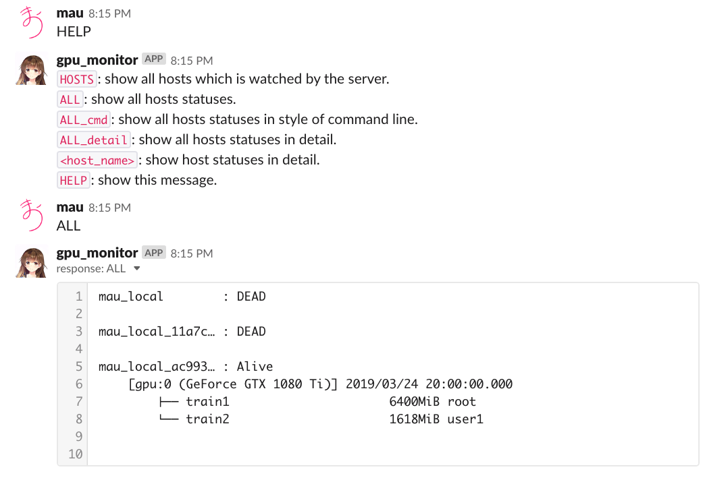

# Requirements
This script is depending on `Python3`, and `nvidia-smi`, `awk`, `ps` commands.  

# Setup
```
pip install -r requirements.txt
```  
If there is a missing package, please install by yourself using pip.  
Also you might need to setup some configurations for your own environment.   

# Configuration
When using `gpu_status_server.py` and `gpu_info_sender.py`, there are many options to change the settings, or you can use .yaml file for overwriting the arguments.  
Use `-h` to see all arguments and use `--local_settings_yaml_path` option to overwrite.  
Example is in `example/local_settings.yaml`  

# Usage
You can use simple wrapper,  
for Server  
```
python gpu_status_server.py
```  
  
for Nodes
```
python gpu_info_sender.py
```  
   
For automation, using systemd and crontab will do the work.  

## from Terminal
To get GPU information from terminal app, use curl and access `http://<server_address>/?term=true`.  
You will get like  
```
$ curl "http://0.0.0.0:8080/?term=true"
+------------------------------------------------------------------------------+
| vesta ver. 1.0.0                                                   gpu info. |
+------------------+------------------------+-----------------+--------+-------+
| host             | gpu                    | memory usage    | volat. | temp. |
+------------------+------------------------+-----------------+--------+-------+
|mau_local         | 0:GeForce GTX 1080 Ti  |   8018 /  11169 |     0 %|  80 °C|
|                  | 1:GeForce GTX 1080 Ti  |      2 /  11172 |     0 %|  38 °C|
+------------------+------------------------+-----------------+--------+-------+
|mau_local_11a7c5eb| 0:GeForce GTX 1080 Ti  |   8018 /  11169 |    92 %|  80 °C|
|                  | 1:GeForce GTX 1080 Ti  |      2 /  11172 |     0 %|  38 °C|
+------------------+------------------------+-----------------+--------+-------+
|mau_local_ac993634| 0:GeForce GTX 1080 Ti  |   8018 /  11169 |    92 %|  80 °C|
|                  | 1:GeForce GTX 1080 Ti  |      2 /  11172 |     0 %|  38 °C|
|                  | 1:GeForce GTX 1080 Ti  |      2 /  11172 |     0 %|  38 °C|
|                  | 1:GeForce GTX 1080 Ti  |      2 /  11172 |     0 %|  38 °C|
+------------------+------------------------+-----------------+--------+-------+
```

If you want to see detail information you can use `detail` option like `http://<server_address>/?term=true&detail=true`.  
You will get like  
```
$ curl "http://0.0.0.0:8080/?term=true&detail=true"
vesta ver. 1.0.0

#### mau_local_19e5d26c :: 127.0.0.1 ###########################################
  last update: 24/03/2019 20:27:10
--------------------------------------------------------------------------------
  ┌[ gpu:0 GeForce GTX 1080 Ti 2019/03/24 20:00:00.000 ]─────────────────────┐
  │      memory used  memory available  gpu volatile  temperature            │
  │  8018 / 11169MiB           3151MiB           92%         80°C            │
  │                                                                          │
  │ mem [///////////////////////////////////////////                  ]  71% │
  │  ├── train1                      6400MiB root                            │
  │  └── train2                      1618MiB user1                           │
  └──────────────────────────────────────────────────────────────────────────┘

  ┌[ gpu:1 GeForce GTX 1080 Ti 2019/03/24 20:00:00.000 ]─────────────────────┐
  │      memory used  memory available  gpu volatile  temperature            │
  │     2 / 11172MiB          11170MiB            0%         38°C            │
  │                                                                          │
  │ mem [                                                             ]   0% │
  └──────────────────────────────────────────────────────────────────────────┘

________________________________________________________________________________

```
  
Server will also provide you to access host data by json.
Access `http://<server_address>/states/<host_name>/`, or to specify host `http://<server_address>/states/<host_name>/`  
You can use url parameter to fetch how many log you want by `fetch_num=<# you want>`  

## from Web Browser
Just access `http://<server_address>/`  
You will get like  

  
# API Response 
User can get the information of GPU by accessing `http://<server_address>/states/`.  
Json response is like
```
{
    "host1":{
        # the order of data is ascending order in time
        "data":
            # host_name log are in array
            [ 
                {   # each GPU will be denote by "gpu:<device_num>"
                    'gpu_data':{
                        'gpu:0':{'available_memory': '10934',
                            'device_num': 0,
                            'gpu_name': 'GeForce GTX 1080 Ti',
                            'gpu_volatile': 92,
                            'processes': [
                                  {
                                    'name': 'train1',
                                    'pid': "31415",
                                    'used_memory': 6400,
                                    'user': 'root'
                                  },
                                  {
                                    'name': 'train2',
                                    'pid': "27182",
                                    'used_memory': 1618,
                                    'user': 'user1'
                                  }
                            ],
                            'temperature': 80,
                            'timestamp': '2019/03/24 20:00:00.000',
                            'total_memory': 11169,
                            'used_memory': 8018,
                            'uuid': 'GPU-...'
                        },
                        'gpu:1':{
                            'available_memory': '11170',
                            'device_num': '1',
                            'gpu_name': 'GeForce GTX 1080 Ti',
                            'gpu_volatile': '0',
                            'processes': [],
                               .
                               .
                               .

                        }
                    },
                    "timestamp": 20181130232947 # server recorded timestamp YYYYMMDDhhmmss
                }
            ],
        "ip_address": 127.0.0.1 # host IP address
    },
    "host2":{...}
}
```

# Slack Notification
If you set slack's webhook and bot setting, you can receive notification via slack.  
## up and down
  
  
## interact with bot
  
  
For specifying slack setting, use `--slack_webhook`, `--slack_bot_token`, and `--slack_bot_post_channel` for `gpu_status_server.py`.  
Or you can use .yaml file, see `example/local_settings.yaml`  

# Topology
Topology is very simple, Master (server) and Slave (each local machine) style, but it is ad hoc.  
Server is only waiting the slaves to post the gpu information.  

# Database
## machine table
`mchine` table is a lookup table for hash_code (id) to host name.  
Table field is

| id (TEXT) | name (TEXT)| ip_address (TEXT)|
|-----------|------------|------------|
| hash_code_1 | host_1 | host_1_ip |
| hash_code_2 | host_2 | host_2_ip |
| ... | ... | ... |
| hash_code_n | host_n | host_n_ip |
  
hash_code will be generated by Python code  
```
hash_code = random.getrandbits(128)
```
  
## {host} table
Each host has own table for logging.  
Table field is  

| timestamp (INTEGER) | data (BLOB)|
|-----------|------------| 
| timestamp_1 | data_1 |
| timestamp_2 | data_2 |
| ... | ... |
| timestamp_n | data_n |
  
`timestamp` is based on server time zone and the style is "YYYYMMDDhhmmss".  
`data` is a Python dict object while it is serialized and compressed by Python pickle and bz2.  
